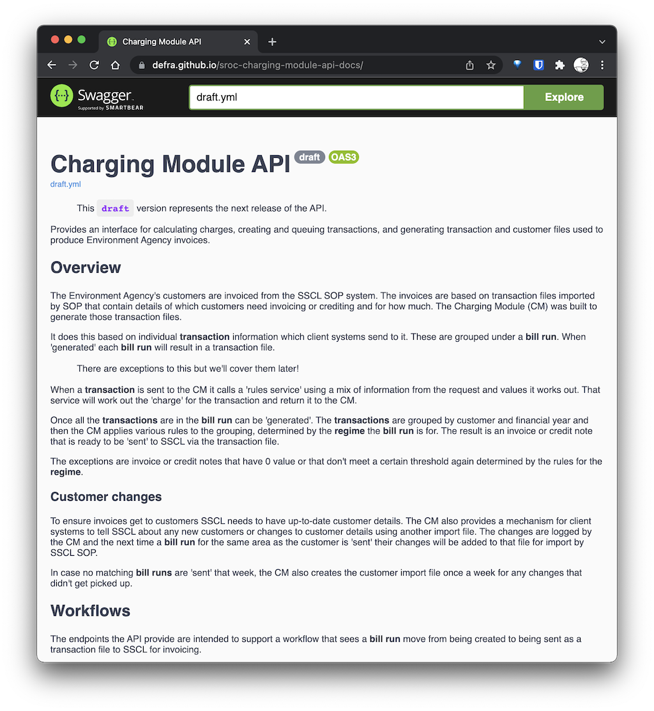
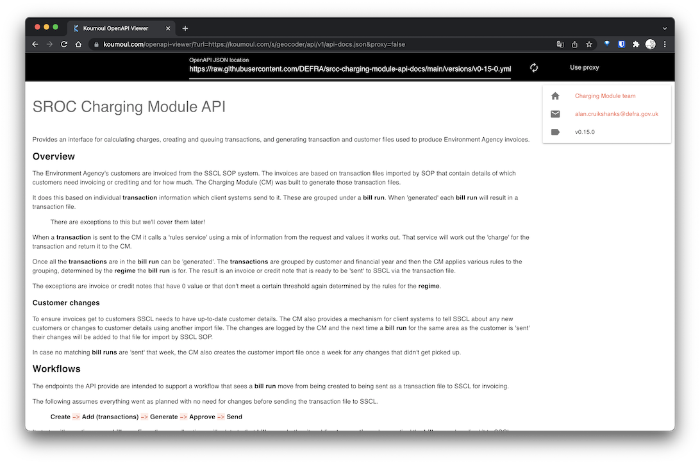
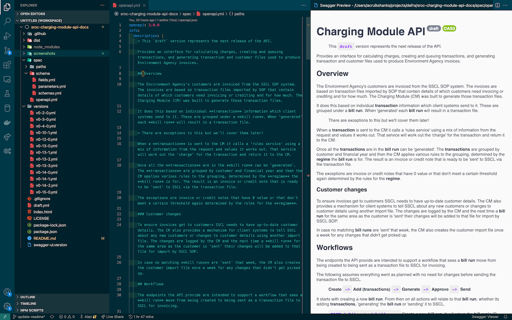

# SROC Charging Module API Docs

> WIP replacement for how we currently manage our OpenAPI spec in [sroc-service-team](https://github.com/DEFRA/sroc-service-team)

Home of the OpenAPI spec that documents the functionality of the [Charging Module API](https://github.com/DEFRA/sroc-charging-module-api). It was built from the [swagger-github-pages template](https://github.com/peter-evans/swagger-github-pages) which adds the ability to view and interact with the documentation using GitHub pages.

## Viewing the documentation

Users of the API can interact with the very latest version of the spec at <https://defra.github.io/sroc-charging-module-api-docs>. This is our **draft** version and contains the very latest changes.



> Note - We're aware the Explore feature is not working. We're new to [Swagger-UI](https://github.com/swagger-api/swagger-ui) and still trying to understand what the issue is.

## Versioned specs

Each time we version and then release the API we generate and save a version of the OpenAPI spec. You can find these in [/versions](versions).

You can view them in the same way using a tool like [Postman](https://www.postman.com/) or [Insomnia](https://insomnia.rest/) (look for the ability to import a file). If you don't have access to a tool you can use something like [Openapi-Viewer](https://koumoul.com/openapi-viewer/), which is an online tool that will render OpenAPI specs from a url. We found giving it the raw GitHub url, for example, <https://raw.githubusercontent.com/DEFRA/sroc-charging-module-api-docs/main/versions/v0-15-0.yml> works great.



## Understanding the documentation

The API is documented using the [OpenAPI specification](https://swagger.io/docs/specification/about/).

The OpenAPI spec is just version 3 of the [Swagger specification](https://swagger.io/docs/specification/2-0/what-is-swagger/). This is why you'll often see references to Swagger and why this project is built on something called **swagger-ui**.

You can also access the [full spec](https://github.com/OAI/OpenAPI-Specification) on GitHub.

Our working files are in [/spec](spec) with [/spec/openapi.yml](openapi.yml) as the root document. Most how-tos and examples will do everything in this one file. But even a small API when documentated in this way will result in it becoming thousands of lines long, which we believe makes it unworkable.

In our project we use [$ref's](https://swagger.io/docs/specification/using-ref/) in `openapi.yml` to reference [/spec/paths](path) and [/spec/schema](schema) definitions held in other files. This helps keep the files smaller and specific to their purpose or domain.

Most viewers and tools however, still expect a dereferenced single file. So, [/spec](/spec) contains our working version from which we generate [draft.yml](draft.yml) which is used by **swagger-ui** and GitHub pages to build our [site](https://defra.github.io/sroc-charging-module-api-docs).

## Maintaining the documentation

> The following is for Charging Module service team members who need to make changes to these docs.

Our documentation serves as both a reference for us and our users. As changes are made to the API the team is expected to update the docs to match.

### Pre-requisites

You just need [Node.js](https://nodejs.org/en/) installed, ideally an LTS version.

### Installation

First clone the repository and then drop into your new local repo:

```bash
git clone https://github.com/DEFRA/sroc-charging-module-api-docs.git && cd sroc-charging-module-api-docs
```

Next download and install the dependencies

```bash
npm install
```

### Setup

The [spec](/spec) is all defined in [YAML](https://en.wikipedia.org/wiki/YAML) so any text editor will do. The one thing that will really help is being able to preview the documentation as you work. At this time [VSCode](https://code.visualstudio.com/) is prevalent in the team. They use the extension [Swagger Viewer](https://marketplace.visualstudio.com/items?itemName=Arjun.swagger-viewer).



This is provided to help those new to working with the spec. Contributors are welcome to setup their local environment as they see fit.

### Generating draft.yml

If your change to this project involves making a change to something in [/spec](spec) you must also re-generate [draft.yml](draft.yml). To do this run

```bash
npm start
```

You should see your changes to the spec reflected in the diff for `draft.yml`. Commit this change as part of your PR.

### Generating versions

When a new version of the [Charging Module API](https://github.com/DEFRA/sroc-charging-module-api) is [signed off](https://github.com/DEFRA/sroc-service-team/blob/main/releasing/cha/sign_off.md) ready for release a copy of `draft.yml` should be added to [/versions](/versions) and renamed accordingly.

## Contributing to this project

If you are not part of the Charging Module team but have an idea you'd like to contribute, please [log an issue](https://github.com/DEFRA/sroc-service-team/issues).

All contributions should be submitted via a pull request.

## License

THIS INFORMATION IS LICENSED UNDER THE CONDITIONS OF THE OPEN GOVERNMENT LICENCE found at:

<http://www.nationalarchives.gov.uk/doc/open-government-licence/version/3>

The following attribution statement MUST be cited in your products and applications when using this information.

> Contains public sector information licensed under the Open Government license v3

### About the license

The Open Government Licence (OGL) was developed by the Controller of Her Majesty's Stationery Office (HMSO) to enable information providers in the public sector to license the use and re-use of their information under a common open licence.

It is designed to encourage use and re-use of information freely and flexibly, with only a few conditions.
